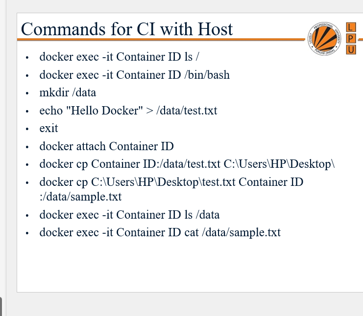
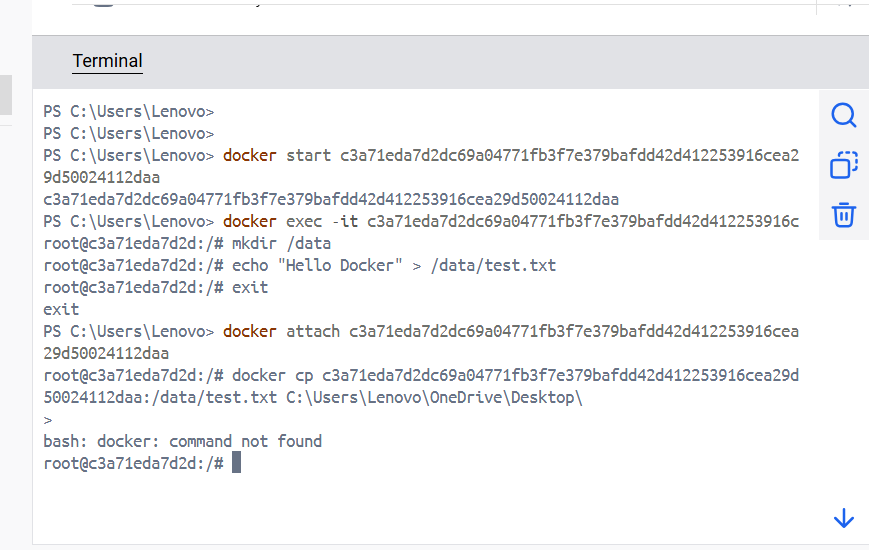
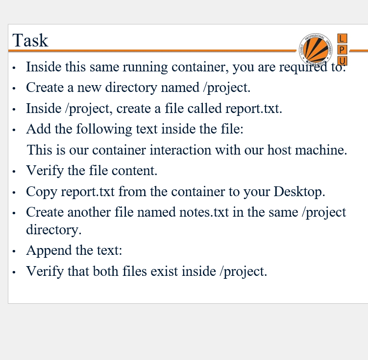
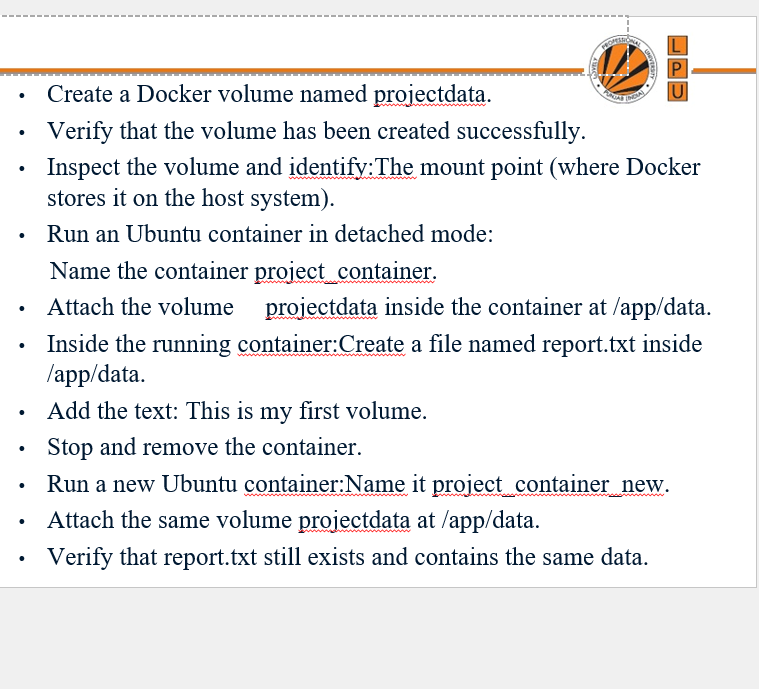
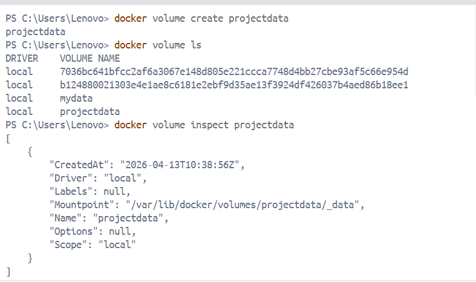
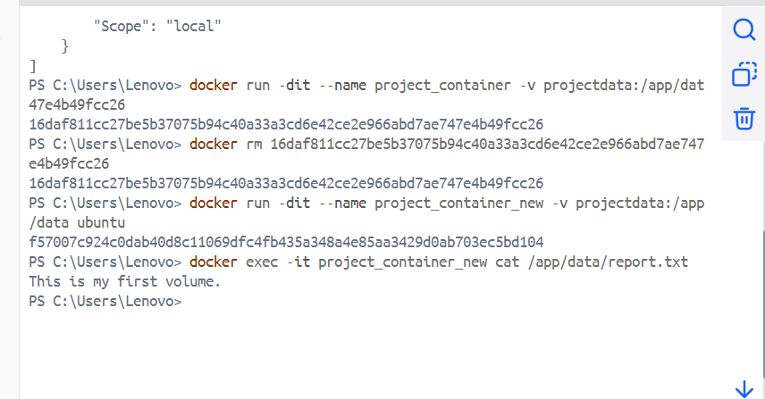

# Question Practice (Screenshots)

This repository includes practice questions and their solutions as screenshots.

## Practice set

| Question | Solution(s) |
| --- | --- |
| Q1 | [sol1.png](images/sol1.png) |
| Q2 | [sol2 -a.png](<images/sol2 -a.png>), [sol2 -b.png](<images/sol2 -b.png>) |
| Q3 | [sol3-a.png](images/sol3-a.png), [sol3-b.png](images/sol3-b.png) |

### Q1

View question and solution

**Question**

**Solution**

### Q2

View question and solutions

**Question**

**Solution (A)**

**Solution (B)**

### Q3

View question and solutions

**Question**

**Solution (A)**

**Solution (B)**

