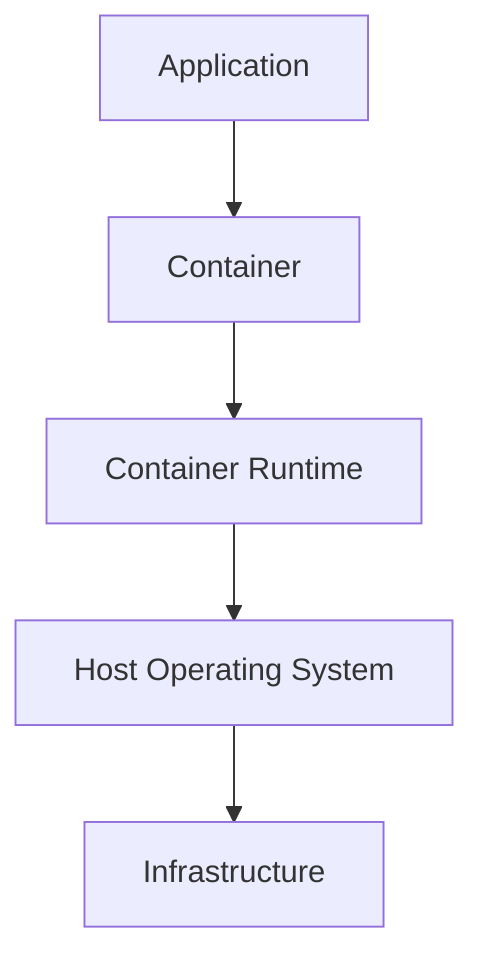
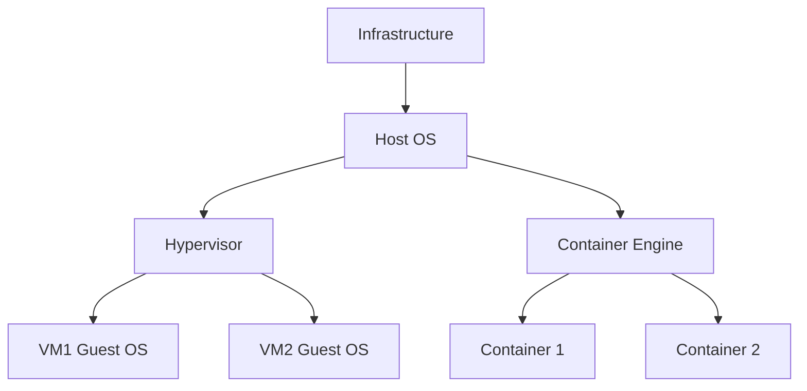

# 📦 Basics of DevOps Infrastructure: Introduction to Containers

---

## 📌 1. What Are Containers?

A **container** is a lightweight package that includes:

- Application code
- Runtime environment
- System libraries
- Dependencies
- Configuration files

This allows applications to run **consistently across different systems**.

> 💡 **Simple definition:**
> A container is a portable environment that packages an application and everything it needs to run.

---

## ❗ Problem Before Containers

Before containers, teams often faced this issue:

> "It works on my machine but not on yours."

This happened due to differences in:

- Operating systems
- Library versions
- Environment configuration

**Example:**

- Developer machine → Python 3.10
- Server machine → Python 3.8

The app may fail because of version mismatch.

Containers solve this by **packaging everything together**.

---

## 🕰️ 2. Origin of Containers

Containerization is not brand-new. The idea evolved over decades.

### Early Container Technologies

| Year | Technology |
| --- | --- |
| 1979 | Unix `chroot` |
| 2000 | FreeBSD Jails |
| 2004 | Solaris Containers |
| 2008 | Linux Containers (LXC) |
| 2013 | Docker |

### 🧠 `chroot` (1979)

`chroot` in Unix allowed a process to run inside an **isolated filesystem root**.

```text
System Root
│
├── User Programs
├── Libraries
└── System Files
```

It was useful, but **limited and not fully secure**.

### 📦 Linux Containers (LXC)

LXC introduced stronger container capabilities:

- Process isolation
- Resource management
- Separate networking and filesystem views

But it was still relatively **complex for developers**.

---

## 🚀 3. Emergence of Modern Containerization

Modern container adoption accelerated with **Docker (2013)**.

Docker made containers:

- Easy to use with simple commands
- Easy to package and share
- Fast to deploy
- Portable across development, testing, and production

---

## ⚙️ Container Architecture

Containers share the **host OS kernel** while keeping applications isolated.



---

## 🖥️ Containers vs Virtual Machines

| Feature | Virtual Machine | Container |
| --- | --- | --- |
| OS | Each VM has its own guest OS | Shares host OS kernel |
| Size | Large (GBs) | Small (MBs) |
| Startup Time | Slower | Very fast |
| Performance | Higher overhead | Lightweight |

### Architecture Comparison



---

## 🔗 4. Integration of Containers into DevOps

Containers are essential in modern DevOps workflows because they support **build once, run anywhere**.

### DevOps Workflow with Containers


### Why DevOps Uses Containers

- Consistent development environments
- Faster deployments
- Easier scaling
- Smooth CI/CD integration
- Better support for microservices

---

## 🌍 Real-World Example: Netflix

Netflix runs thousands of services using container-based infrastructure.

**Benefits:**

- Easy service scaling
- Faster deployments
- Better resource utilization

---

## 📈 Advantages of Containers

- Lightweight and fast
- Portable across environments
- Efficient resource usage
- Faster release cycles
- Easy horizontal scaling
- Ideal for microservices

---

## 📝 Summary

- Containers package apps with all dependencies.
- They solve environment mismatch issues.
- The journey evolved from `chroot` and LXC to Docker.
- Containers are now a core part of DevOps and CI/CD.